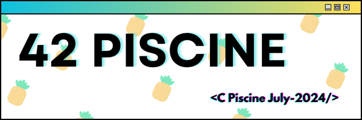

# Piscine 42

  

## Stats
Username: ffierro-

Level: level 8 - 23%

Result: Pass

---

## Individual Projects

<table align="center">
  <tr>
    <th>Project</th>
    <th>Grade</th>
    <th>Status</th>
  </tr>
  <tr>
    <td align="center"><a href="https://github.com/mfranck340/piscine-42/tree/main/projects/shell-00">Shell00</a></td>
    <td align="center"><strong><i>100 / 100</i></strong></td>
    <td align="center"><strong><i>Done - Presented</i></strong></td>
  </tr>
  <tr>
    <td align="center"><a href="https://github.com/mfranck340/piscine-42/tree/main/projects/shell-01">Shell01</a></td>
    <td align="center"><strong><i>85 / 100</i></strong></td>
    <td align="center"><strong><i>Done - Presented</i></strong></td>
  </tr>
  <tr>
    <td align="center"><a href="https://github.com/mfranck340/piscine-42/tree/main/projects/piscine-c00">C00</a></td>
    <td align="center"><strong><i>85 / 100</i></strong></td>
    <td align="center"><strong><i>Done - Presented</i></strong></td>
  </tr>
  <tr>
    <td align="center"><a href="https://github.com/mfranck340/piscine-42/tree/main/projects/piscine-c01">C01</a></td>
    <td align="center"><strong><i>100 / 100</i></strong></td>
    <td align="center"><strong><i>Done - Presented</i></strong></td>
  </tr>
  <tr>
    <td align="center"><a href="https://github.com/mfranck340/piscine-42/tree/main/projects/piscine-c02">C02</a></td>
    <td align="center"><strong><i>65 / 100</i></strong></td>
    <td align="center"><strong><i>Done - Presented</i></strong></td>
  </tr>
  <tr>
    <td align="center"><a href="https://github.com/mfranck340/piscine-42/tree/main/projects/piscine-c03">C03</a></td>
    <td align="center"><strong><i>50 / 100</i></strong></td>
    <td align="center"><strong><i>Done - Presented</i></strong></td>
  </tr>
  <tr>
    <td align="center"><a href="https://github.com/mfranck340/piscine-42/tree/main/projects/piscine-c04">C04</a></td>
    <td align="center"><strong><i>70 / 100</i></strong></td>
    <td align="center"><strong><i>Done - Presented</i></strong></td>
  </tr>
  <tr>
    <td align="center"><a href="https://github.com/mfranck340/piscine-42/tree/main/projects/piscine-c05">C05</a></td>
    <td align="center"><strong><i>80 / 100</i></strong></td>
    <td align="center"><strong><i>Done - Presented</i></strong></td>
  </tr>
  <tr>
    <td align="center"><a href="https://github.com/mfranck340/piscine-42/tree/main/projects/piscine-c06">C06</a></td>
    <td align="center"><strong><i>100 / 100</i></strong></td>
    <td align="center"><strong><i>Done - Presented</i></strong></td>
  </tr>
  <tr>
    <td align="center"><a href="https://github.com/mfranck340/piscine-42/tree/main/projects/piscine-c07">C07</a></td>
    <td align="center"><strong><i>60 / 100</i></strong></td>
    <td align="center"><strong><i>Done - Presented</i></strong></td>
  </tr>
  <tr>
    <td align="center"><a href="https://github.com/mfranck340/piscine-42/tree/main/projects/piscine-c08">C08</a></td>
    <td align="center"><strong><i>70 / 100</i></strong></td>
    <td align="center"><strong><i>Done - Presented</i></strong></td>
  </tr>
  <tr>
    <td align="center"><a href="https://github.com/mfranck340/piscine-42/tree/main/projects/piscine-c09">C09</a></td>
    <td align="center"><strong><i>NULL</i></strong></td>
    <td align="center"><strong><i>Not Done - Not Presented</i></strong></td>
  </tr>
  <tr>
    <td align="center"><a href="https://github.com/mfranck340/piscine-42/tree/main/projects/piscine-c10">C10</a></td>
    <td align="center"><strong><i>NULL</i></strong></td>
    <td align="center"><strong><i>Not Done - Not Presented</i></strong></td>
  </tr>
  <tr>
    <td align="center"><a href="https://github.com/mfranck340/piscine-42/tree/main/projects/piscine-c11">C11</a></td>
    <td align="center"><strong><i>NULL</i></strong></td>
    <td align="center"><strong><i>Not Done - Not Presented</i></strong></td>
  </tr>
  <tr>
    <td align="center"><a href="https://github.com/mfranck340/piscine-42/tree/main/projects/piscine-c12">C12</a></td>
    <td align="center"><strong><i>NULL</i></strong></td>
    <td align="center"><strong><i>Not Done - Not Presented</i></strong></td>
  </tr>
  <tr>
    <td align="center"><a href="https://github.com/mfranck340/piscine-42/tree/main/projects/piscine-c13">C13</a></td>
    <td align="center"><strong><i>NULL</i></strong></td>
    <td align="center"><strong><i>Not Done - Not Presented</i></strong></td>
  </tr>
</table>

## Team Projects

<table align="center">
  <tr>
    <th>Project</th>
    <th>Grade</th>
    <th>Status</th>
  </tr>
  <tr>
    <td align="center"><a href="https://github.com/mfranck340/piscine-42/tree/main/projects/rush-00">Rush00</a></td>
    <td align="center"><strong><i>0 / 100</i></strong></td>
    <td align="center"><strong><i>Done - Presented</i></strong></td>
  </tr>
  <tr>
    <td align="center"><a href="https://github.com/mfranck340/piscine-42/tree/main/projects/rush-01">Rush01</a></td>
    <td align="center"><strong><i>0 / 100</i></strong></td>
    <td align="center"><strong><i>Done - Presented</i></strong></td>
  </tr>
  <tr>
    <td align="center"><a href="https://github.com/mfranck340/piscine-42/tree/main/projects/rush-02">Rush02</a></td>
    <td align="center"><strong><i>10 / 100</i></strong></td>
    <td align="center"><strong><i>Done - Presented</i></strong></td>
  </tr>
  <tr>
    <td align="center"><a href="https://github.com/mfranck340/piscine-42/tree/main/projects/BSQ">BSQ</a></td>
    <td align="center"><strong><i>50 / 100</i></strong></td>
    <td align="center"><strong><i>Done - Presented</i></strong></td>
  </tr>
</table>

## Exams

<table align="center">
  <tr>
    <th>Project</th>
    <th>Grade</th>
  </tr>
  <tr>
    <td align="center"><strong>Exam00</strong></td>
    <td align="center"><strong><i>0 / 100</i></strong></td>
  </tr>
  <tr>
    <td align="center"><strong>Exam01</strong></td>
    <td align="center"><strong><i>90 / 100</i></strong></td>
  </tr>
  <tr>
    <td align="center"><strong>Exam02</strong></td>
    <td align="center"><strong><i>100 / 100</i></strong></td>
  </tr>
  <tr>
    <td align="center"><strong>FinalExam</strong></td>
    <td align="center"><strong><i>66 / 100</i></strong></td>
  </tr>
</table>
